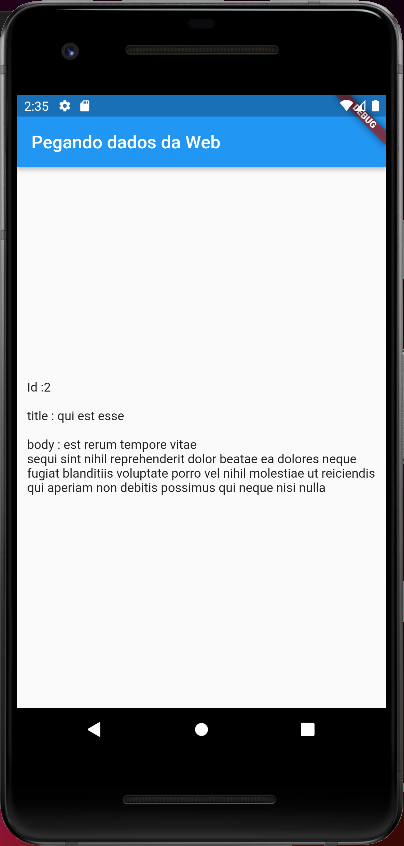

# Acesso-Https

_Autor:\
Marcius Bezerra\
[marciusbezerr@gmail.com](mailto:marciusbezerr@gmail.com)_

Demostração simples em Flutter de como fazer um request a API do _jsonplaceholder_ trazendo o resultado para a tela.
